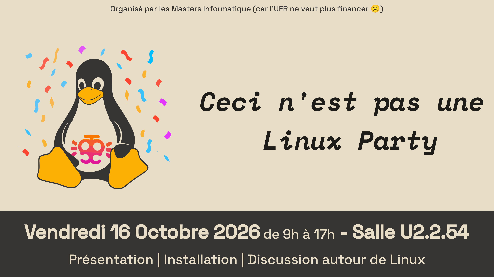

```
  ____     __  __  ____            __
 /\  _`\  /\ \/\ \/\  _`\         /\ \       __
 \ \ \/\_\\ \ `\\ \ \ \L\ \       \ \ \     /\_\    ___   __  __  __  _
  \ \ \/_/_\ \ , ` \ \ ,__/        \ \ \  __\/\ \ /' _ `\/\ \/\ \/\ \/'\
   \ \ \L\ \\ \ \`\ \ \ \/          \ \ \L\ \\ \ \/\ \/\ \ \ \_\ \/>  </
    \ \____/ \ \_\ \_\ \_\           \ \____/ \ \_\ \_\ \_\ \____//\_/\_\
     \/___/   \/_/\/_/\/_/            \/___/   \/_/\/_/\/_/\/___/ \//\/_/

  ____                 __                  ___       __      ___      ____
 /\  _`\              /\ \__             /'___`\   /'__`\  /'___`\   /'___\
 \ \ \L\ \ __     _ __\ \ ,_\  __  __   /\_\ /\ \ /\ \/\ \/\_\ /\ \ /\ \__/
  \ \ ,__/'__`\  /\`'__\ \ \/ /\ \/\ \  \/_/// /__\ \ \ \ \/_/// /__\ \  _``\
   \ \ \/\ \L\.\_\ \ \/ \ \ \_\ \ \_\ \    // /_\ \\ \ \_\ \ // /_\ \\ \ \L\ \
    \ \_\ \__/.\_\\ \_\  \ \__\\/`____ \  /\______/ \ \____//\______/ \ \____/
     \/_/\/__/\/_/ \/_/   \/__/ `/___/> \ \/_____/   \/___/ \/_____/   \/___/
                                   /\___/
                                   \/__/
```

---

Ce dépôt contient un ensemble d'éléments produits pour **"Ceci n'est pas une Linux
Party 2026"** par des bénévoles étudiants des Masters d'informatique de l'UFR des
sciences et techniques de l'Université de Rouen Normandie **car l'UFR ne veut
plus financer l'événement officiel.**

## Script de post-installation

À la suite de l'installation de la distribution Linux, ce script peut être
exécuté afin :

- de mettre à jour le système
- d'installer une suite de paquets recommandée pour l'université
- de configurer le réseau Eduroam
- de configurer le VPN du département d'informatique
- d'installer les certificats racines du département d'informatique

> [!IMPORTANT]
> Ce script fonctionne **uniquement** pour les distributions basées sur 
> **Debian**.
> 
> Il a été testé et validé uniquement sur les environnements suivants :
> - *Ubuntu 26.04*
> - *Ubuntu 24.04*
> - *Linuxmint 22.3 (cinnamon)*
> - *Linuxmint 22.3 (xfce)*
> - *Xubuntu 26.04*

Vous pouvez lancer ce script grâce à la commande suivante :

```bash
# Exécute l'ensemble du script et demande la saisie de l'identifiant universitaire ainsi qu'éventuellement du mot de passe
curl -s "https://raw.githubusercontent.com/TristanGrlt/CNP_LinuxParty/refs/heads/main/setup.sh" | sudo bash -s -- --ask
```

## Bannière de l'événement


